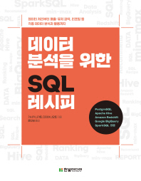

# ✨ SQL 쿼리 작성
### 다수의 책과 SQL 문제 풀이를 통해 복잡한 쿼리도 작성할 수 있는 역량을 갖추게 되었다.
- MySQL, PostgreSQL 사용

## 책
1. SQL 레벨업
2. SQL로 맛보는 데이터 전처리 분석
3. 데이터 분석을 위한 SQL 레시피
	- **실무 쿼리 작성 역량을 높일 수 있었음!**

## SQL 문제 사이트
1. **HackerRank: SQL Level 5 뱃지 획득! 🎉**

2. leetcode
3. programmers
